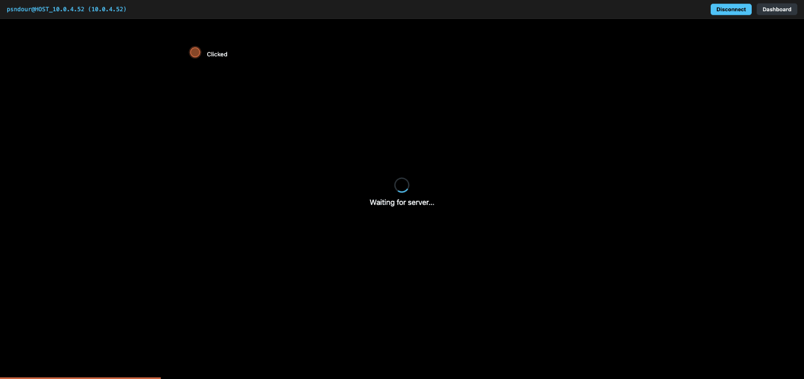
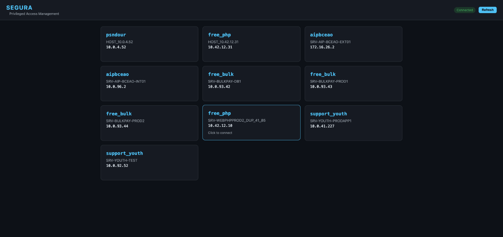
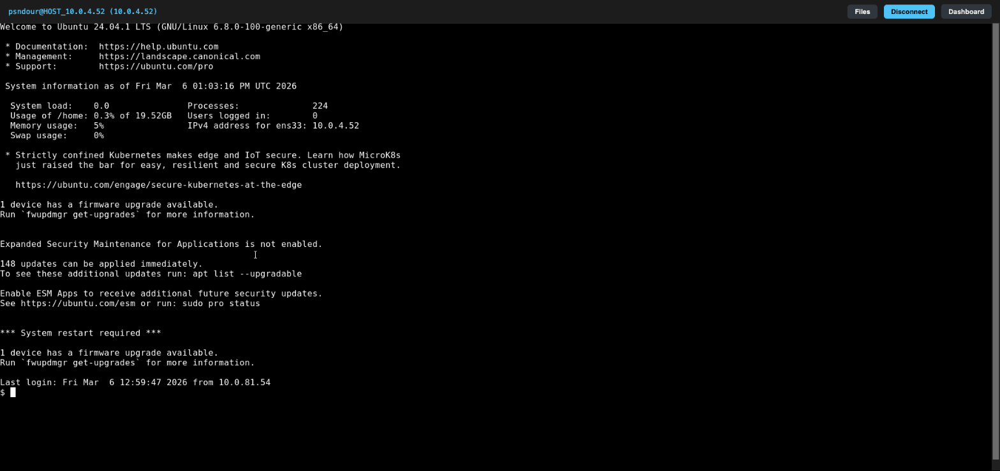
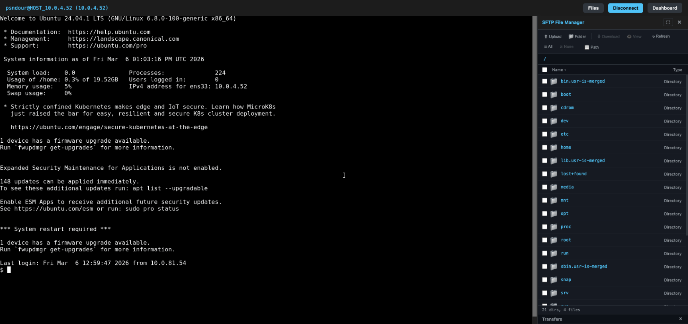

# SEGURA-CLI

A CLI + web app for connecting to remote devices through the **senhasegura PAM** (Privileged Access Management) platform.

SSH terminal, browser-based terminal, SCP file transfer, SFTP file manager — all through your PAM gateway.



---

## Installation

### One-line install (macOS / Linux)

```bash
curl -sSL https://papesambandour.github.io/segura-cli/install.sh | bash
```

This detects your OS/architecture, downloads the latest release, installs to `~/.local/bin/segura`, and sets up shell completion.

### Interactive install

```bash
curl -O https://papesambandour.github.io/segura-cli/install.sh
bash install.sh
```

The interactive mode prompts for your senhasegura credentials and writes them to your shell RC file.

### Manual download

Download the binary for your platform from [GitHub Releases](https://github.com/papesambandour/segura-cli/releases):

| Platform | Binary |
|----------|--------|
| macOS Apple Silicon | `segura-darwin-arm64` |
| macOS Intel | `segura-darwin-amd64` |
| Linux x86_64 | `segura-linux-amd64` |
| Linux ARM64 | `segura-linux-arm64` |

```bash
chmod +x segura-*
mv segura-* ~/.local/bin/segura
```

---

## Configuration

Set these environment variables (in `~/.zshrc`, `~/.bashrc`, or a `.env` file):

| Variable | Description | Required |
|----------|-------------|----------|
| `SEGURA_URL` | senhasegura instance URL | Yes |
| `SEGURA_USER` | Username | Yes |
| `SEGURA_PASSWORD` | Password | Yes |
| `SEGURA_MFA_TOKEN` | TOTP secret (base32) | Yes |
| `SEGURA_TENANT` | Tenant name (auto-detected from URL if omitted) | No |

```bash
export SEGURA_URL="https://your-instance.senhasegura.app/"
export SEGURA_USER="your-username"
export SEGURA_PASSWORD="your-password"
export SEGURA_MFA_TOKEN="YOUR_TOTP_SECRET"
export SEGURA_TENANT="your-tenant"
```

After setting the variables, reload your shell:

```bash
source ~/.zshrc   # or source ~/.bashrc
```

You can also use `--env /path/to/.env` to load from a file.

---

## Commands

### List credentials

```bash
segura list
```

```
Available credentials (3):

  Credential           Device                         Command
  ----------           ------                         -------
  root                 srv-web (10.0.4.52)            segura connect root@10.0.4.52
  admin                srv-db (10.0.4.53)             segura connect admin@10.0.4.53
  deploy               srv-app (10.0.4.54)            segura connect deploy@10.0.4.54
```

### SSH Terminal (default)

```bash
segura connect root@10.0.4.52
```

Direct SSH connection through the senhasegura gateway. TOTP and password are sent automatically. Press `Ctrl+]` to disconnect.

```bash
# Custom SSH port
segura connect root@10.0.4.52 --port 2222
```

### Browser Terminal

```bash
segura connect root@10.0.4.52 --browser
```

Opens a local web terminal in your default browser. Auto-starts the web server daemon if needed.

### SCP File Transfer

```bash
# Local file to remote
segura copy localfile.txt root@10.0.4.52:/tmp/

# Remote file to local
segura copy root@10.0.4.52:/tmp/remotefile.txt ./

# Local directory to remote (recursion auto-enabled)
segura copy ./deploy/ root@10.0.4.52:/tmp/deploy/

# Remote directory to local (use -r for downloads)
segura copy -r root@10.0.4.52:/etc/app ./app-backup/
```

Directories are copied recursively — automatically when the source is a local
directory, or with `-r`/`--recursive` when downloading a remote directory.

Requires `sshpass` (`brew install hudochenkov/sshpass/sshpass` on macOS).

### Auto-login

```bash
segura login
```

Opens senhasegura in Chrome with credentials and TOTP auto-filled.

### Shell completion

```bash
segura install-completion
```

Installs tab-completion for your shell (auto-detects **zsh**, **bash**, or **fish**)
and wires it into your shell RC. It's also run automatically during install and on
every `segura update`, so completion stays in sync with new commands and flags.
Restart your shell (or `source` your RC) to activate it. To generate a script
manually instead, use `segura completion <shell>`.

### Update

```bash
segura update
```

Checks GitHub for a newer version and replaces the binary in-place.

### Uninstall

```bash
segura uninstall
```

Removes the binary, `~/.segura/` data, and SEGURA env vars from shell RC files. Use `-y` to skip confirmation.

### Version

```bash
segura version
```

---

## Web Terminal Server

### Start as daemon

```bash
segura --start --port 8080
segura --stop
segura --restart --port 8080
```

PID file: `~/.segura/segura.pid` | Logs: `~/.segura/segura.log`

### Start in foreground

```bash
segura web --port 8080
```

Then open `http://localhost:8080` in your browser.

---

## Screenshots

### Dashboard

The dashboard shows all available PAM credentials. Click one to open a terminal session.



### Web Terminal

Full Guacamole-based terminal with native copy/paste support (Ctrl+C/V).



### SFTP File Manager

Browse, upload, download, and edit remote files. Supports sudo for permission-restricted operations.



---

## Web Terminal Features

### Terminal
- Full Guacamole terminal rendered in the browser
- **Ctrl+C / Ctrl+V** — native copy/paste (text sent char-by-char to remote)
- **Ctrl+A** — select all works in browser

### SFTP File Manager
- **Browse** — navigate directories with breadcrumb navigation
- **Upload** — button or drag & drop (files and folders)
- **Download** — select files with checkboxes, click Download
- **View** — double-click any non-binary file
- **Edit** — modify files in-browser, save with one click
- **Sudo** — automatic retry with sudo on permission denied

---

## Build from source

Requires Go 1.25+ (see `go.mod`).

```bash
git clone https://github.com/papesambandour/segura-cli.git
cd segura-cli

# Build for current platform
make build

# Cross-compile all platforms
make release

# Install locally (copies to /usr/local/bin, env vars in .zshrc, shell completion)
make install
```

See [docs/DEPLOYMENT.md](docs/DEPLOYMENT.md) for the full release workflow (CI, versioning, cross-compilation).

---

## Troubleshooting

| Problem | Solution |
|---------|----------|
| `SEGURA_URL is required` | Env vars not loaded. Run `source ~/.zshrc` or use `--env .env` |
| `no PID file found` | No daemon running. Start with `segura --start` |
| `already running` | Use `--stop` or `--restart` |
| `Too many authentication failures` | Check `SEGURA_TENANT` matches your hostname |
| Connection timeout in browser | Auth takes 10-15s on first request. Refresh the page |
| Permission denied (file upload/save) | Retry with sudo when prompted |
| SFTP handshake EOF | SSH Terminal Proxy may not be enabled for this credential |
| Copy/paste not working | Grant clipboard permissions to localhost in your browser |
